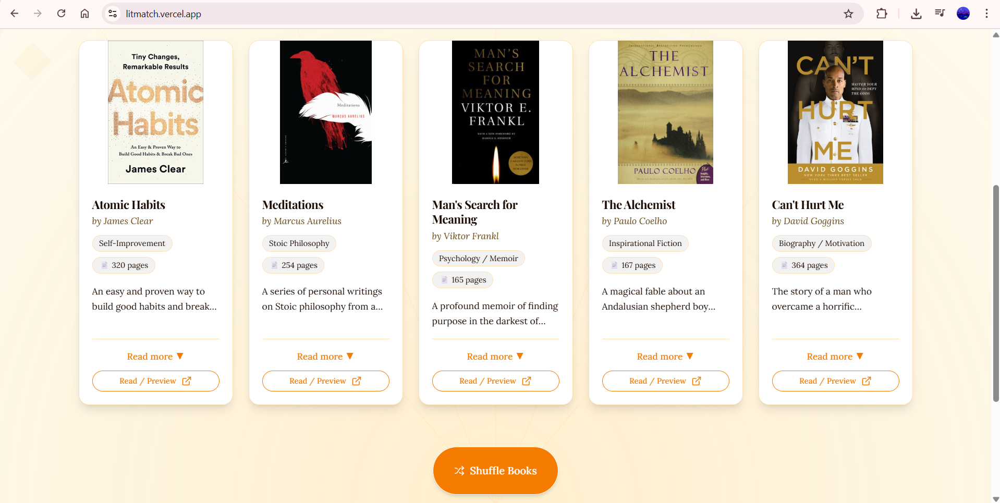
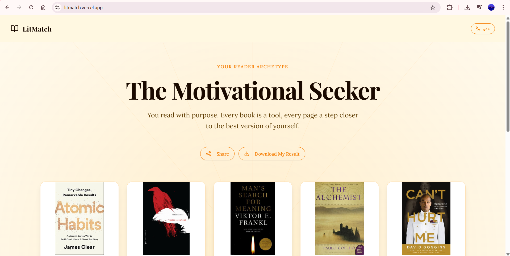
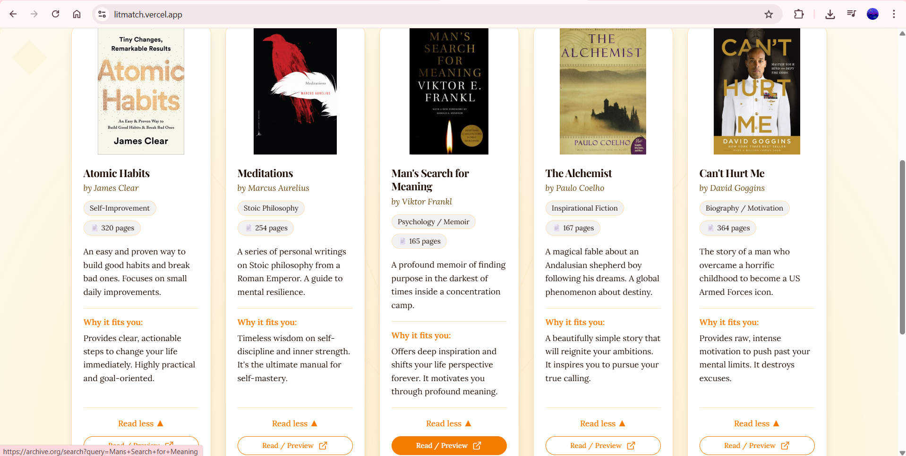

# 📖 LitMatch — AI Book Matchmaker




**LitMatch** is an interactive, personality-driven web application that matches readers with books based on their psychology, mood, and interests. Instead of generic bestseller lists, LitMatch provides an immersive journey to discover your unique literary archetype.

🔗 **[Live Demo: litmatch.vercel.app](https://litmatch.vercel.app)**

---

## ✨ Key Features

* **Psychology-Based Quiz:** A 10-question assessment designed to identify deep reading motivations.
* **5 Reader Archetypes:** Discover identities like *The Deep Thinker*, *The Motivational Seeker*, or *The Cultural Explorer*.
* **Bilingual & RTL Support:** Fully localized experience in English and Arabic, featuring high-quality Right-to-Left (RTL) layout transitions.
* **Immersive UX:** Each archetype features a unique, "maximalist" themed world with custom transitions powered by Framer Motion.
* **Zero-Friction Privacy:** A purely client-side application—no sign-up, no database, and no personal data collection required.
* **Dynamic Result Sharing:** Users can save or share their result cards as images directly from the browser.

---

## 📸 Screenshots

| Archetype Discovery | Tailored Recommendations |
|:---:|:---:|
|  |  |

---

## 🛠️ Tech Stack

* **Frontend:** React 18, TypeScript, Vite
* **Styling:** Tailwind CSS (Responsive Design)
* **Animations:** Framer Motion (Orchestrated Transitions)
* **Deployment:** Vercel

---

## 🚀 Technical Highlights

* **Native Bilingual Engine:** Engineered a custom switching system that handles RTL/LTR layouts and font optimization for Arabic and English.
* **Client-Side Performance:** Optimized for instant response times by handling all calculations and state management within the browser.
* **Dynamic Canvas Rendering:** Integrated client-side image generation to allow users to export their personality cards for social media.

---

## 💻 Getting Started

1.  **Clone the repository:**
    ```bash
    git clone [https://github.com/HadeelAwaji/LitMatch.git](https://github.com/HadeelAwaji/LitMatch.git)
    ```
2.  **Install dependencies:**
    ```bash
    npm install
    ```
3.  **Run the development server:**
    ```bash
    npm run dev
    ```

---

## 👩‍💻 Built By

**Hadeel Awaji** *Frontend & AI Developer* 🔗 [LinkedIn](https://www.linkedin.com/in/hadeelawaji/) | 🐙 [GitHub](https://github.com/HadeelAwaji)

---
© 2026 Hadeel Awaji. Built with passion for readers everywhere.
